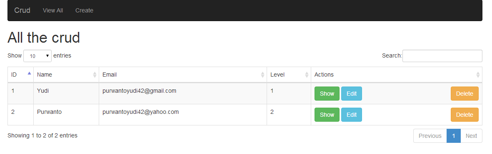

## Laravel Crud with datatable

# Clone

<code>
git clone https://github.com/zhiephie/Crud-Laravel.git
</code>

Next, Update composer using terminal : 

<code>
composer update
</code>

Create database and setting database.php

Next, <code> php artisan migrate </code>

Done!!!

<code>
URL : http://localhost/folder-name/public/crud
</code>

